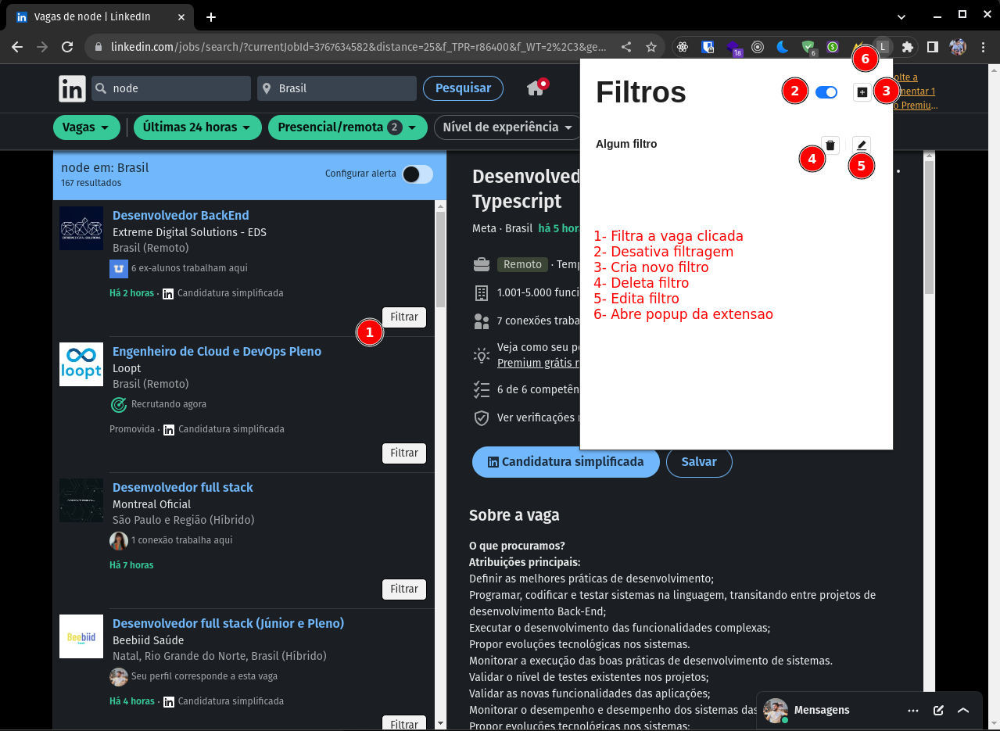

# Denied List for Linkedin

### Descrição

Bem-vindo ao repositório do **Denied List for Linkedin**, uma extensão simples para o Google Chrome que lhe ajudará economizar tempo e permite aos usuários filtrar vagas de emprego de acordo com suas preferências. Utilizando uma funcionalidade de denied list, você pode excluir certas vagas ou empresas dos resultados de busca, personalizando sua experiência de procura de emprego.

---

### Por que utilizar essa extensão?

Recentemente, andei pesquisando algumas oportunidades de emprego, e me deparei com um desafio comum: a predominância de vagas irrelevantes no LinkedIn! originárias de outros portais de emprego. Houve casos em que uma lista de 25 vagas, aproximadamente 20 eram incompatíveis com o que eu procurava, principalmente por serem publicações de outros portais de emprego. Essa situação resultava em uma perda significativa de tempo, pois tinha que filtrar manualmente essas ofertas irrelevantes (e até irritantes).

Então, decidi desenvolver uma solução prática: uma extensão simples para o navegador Google Chrome. O objetivo dessa ferramenta é otimizar o processo de busca por empregos, poupando não só o meu tempo, mas também o de outros usuários. A extensão funciona como um filtro eficaz, removendo automaticamente as vagas que não se alinham às suas preferências e necessidades na lista de pesquisa. Com esta extensão, a busca por vagas se torna mais direcionada e produtiva, eliminando o incômodo de navegar através de inúmeras ofertas irrelevantes.

---

### Tecnologias Utilizadas

Este projeto foi desenvolvido com as seguintes tecnologias:

- [**Google Chrome Extensions**](https://developer.chrome.com/docs/extensions/mv3/): As extensões do Google Chrome são aplicações que adicionam funcionalidades extras e permitem integração com sites e serviços de terceiros no navegador.
- [**React**](https://react.dev/): Para uma interface de usuário dinâmica e responsiva.
- [**TypeScript**](https://www.typescriptlang.org/): Para adicionar tipagem estática ao código, garantindo maior segurança e legibilidade.
- [**Ant Design**](https://ant.design/): Um design system que oferece componentes de UI elegantes e eficientes.

---

### Funcionalidades

- **Denied List de Vagas**: Adicione termos ou nomes de empresas à sua denied list para que estas não apareçam em suas buscas.
- **Integração com Navegador**: Funciona diretamente no Google Chrome, integrando-se perfeitamente com sua experiência de navegação.
- **Personalização Fácil**: Interface intuitiva que permite adicionar ou remover itens da denied list com facilidade.

---

### Como Instalar

1. Baixe a ultima versao build da extensao [aqui](https://github.com/yuripinheirot/denied-list-for-linkedin/releases) na versao ZIP e descompacte
2. Abra o Google Chrome e digite **chrome://extensions/** na barra de endereços.
3. Ative o Modo Desenvolvedor no canto superior direito da página de extensões.
4. Clique em "Carregar sem compactação" e selecione a pasta da extensão descompactada no seu computador.
5. A extensão será carregada e aparecerá na lista de extensões do Chrome.
6. Para uma melhor experiencia, deixe a extensao "pinada" para sempre aparecer na sua barra de extensoes

---

### Como utilizar

1. **Inicie uma Busca no LinkedIn**: Digite um termo de interesse na barra de pesquisa do LinkedIn para visualizar as vagas disponíveis.
2. **Identifique o Botão "Filtrar"**: Nas vagas apresentadas, você notará um botão "Filtrar" adicionado pela extensão em cada uma delas.
3. **Filtre Vagas Indesejadas**: Clique no botão "Filtrar" da vaga que deseja excluir das futuras buscas. Isso removerá a empresa ou a vaga específica de suas pesquisas posteriores.
4. **Gerenciamento de Filtros**: Para ajustar ou revisar seus filtros atuais, clique no ícone da extensão, localizado na barra de ferramentas do Chrome. Uma interface simples permitirá que você gerencie suas preferências de filtro.

Seguindo estes passos, a extensão ajudará a otimizar sua busca por empregos no LinkedIn, removendo automaticamente as vagas indesejadas.

---

### Contribuições

Contribuições são sempre bem-vindas! Se você tem alguma ideia ou sugestão para melhorar a extensão, sinta-se à vontade para criar um pull request ou abrir uma issue.

---

### Licença

Este projeto está sob a licença MIT. Veja o arquivo `LICENSE` para mais detalhes.
